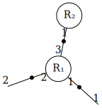
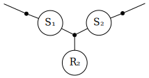
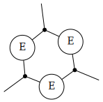

class: title, no-footer


.two-line[


# (Co)relational computing in Catlab: <br> The operad of UWDs and its algebras


]


.two-line[


## Evan Patterson </br> Topos Institute


]


### MIT Categories Seminar, December 10, 2020


???


**Abstract**: The operad of undirected wiring diagrams and its algebras model systems that compose in an undirected style. We explain these ideas informally and show how they are implemented in Catlab, a framework for applied category theory written in the Julia programming language. The abstract notions are illustrated by the examples of tensor networks and pixel arrays, conjunctive queries on relational databases, and open systems as modeled by structured cospans.


---


# Contributors to Catlab and AlgebraicJulia


---


# Acknowledgments


For the past six months, my work has been funded by:


  * David Spivak at MIT
  * via a grant from the Air Force Office of Scientific Research (AFOSR)


---


# Composition: functional vs relational


*Functional* composition dominates in:


  * category theory
  * mathematics generally
  * most programming languages


But many systems naturally compose in an **undirected** way:


  * as *relations*: systems of equations or inequalities
  * as *spans*: tables in relational databases
  * as *corelations* or *cospans*: models of open physical systems


---


# Composition: biased vs unbiased


In most algebraic structures, composition operations are:


  * decomposed into primitive operations, e.g. sequential composition ($\circ$) and monoidal product ($\otimes$)
  * **biased** toward fixed arities, e.g. binary operations


In **unbiased** formulations, compositions are:


  * specified all at once, for any arity
  * combinatorial objects in their own right, such wiring diagrams


---


# A partial classification


Applied category theory offers mathematics to describe composition in all four styles:


<table style="margin-left: auto; margin-right: auto; border-spacing: 0.5em;"> <thead>   <tr>     <th></th>     <th>Directed</th>     <th>Undirected</th>   </tr> </thead> <tbody>   <tr>     <td><strong>Biased</strong></td>     <td>Monoidal categories</td>     <td>Hypergraph categories</td>   </tr>   <tr>     <td><strong>Unbiased</strong></td>     <td>Wiring diagrams, </br> aka string diagrams</td>     <td><em>Undirected wiring diagrams</em> </br> (this talk)</td>   </tr> </tbody> </table>


Catlab runs the gamut, but this talk is about UWDs and their applications, a focus of recent work.


---


class: col-2


# Undirected wiring diagrams


UWDs ([Spivak 2013](https://arxiv.org/abs/1305.0297)) look like:


**Terminology**:


  * Large, unfilled circles are *boxes*
  * Small, filled circles are *junctions*
  * Each box has finite set of *ports*
  * Dangling wires are *outer ports*


**Note**: Junctions of degree two are left implicit. 


---


# Syntax & semantics, operad & algebras


UWDs are an unbiased **syntax** for undirected composition:


  * Not a textual syntax, a *combinatorial* one
  * Embodied in code by a data structure
  * Formalized as an *operad*


Systems that compose in this way give different **semantics**:


  * Various mathematical objects: tensors, relations, etc
  * Various embodiments in code: arrays, data tables, graphs, etc
  * Formalized as *operad algebras*


---


class: col-2


# Example 1: Tensor networks


  * Boxes are tensors
  * Ports are indices
  * Junctions are contractions


.footer[


  * Image source: [tensornetwork.org](https://tensornetwork.org/)


]


---


class: compact col-2


# Example 2: Conjunctive queries


In relational databases literature, traditionally drawn as *hypergraphs*:


  * Boxes are data tables (spans)
  * Ports are column names
  * Junctions are joined columns


.footer[


  * Image source, left: [Gottlob et al 2016](https://doi.org/10.1145/2902251.2902309)


]


---


class: compact col-2


# Example 3: Open systems


Open systems can be formalized as *decorated cospans* ([Fong 2015](http://www.tac.mta.ca/tac/volumes/30/33/30-33abs.html)) or *structured cospans* ([Baez & Courser 2020](http://www.tac.mta.ca/tac/volumes/35/48/35-48abs.html)).


For example, *open Petri nets* ([Baez & Master 2020](https://doi.org/10.1017/S0960129520000043)):


  * Boxes are open systems
  * Ports are interfaces of systems
  * Junctions are gluings along interfaces


.footer[


  * Image source, left: [Baez & Master 2020](https://doi.org/10.1017/S0960129520000043)


]


---


# Outline


1. **Syntax**: Undirected wiring diagrams (UWDs)

      * As an operad
      * As $\mathcal{C}$-sets
      * Implementation of $\mathcal{C}$-sets and UWDs
2. **Semantics**: UWD-algebras

      * Tensor networks and pixel arrays
      * Conjunctive queries on databases and $\mathcal{C}$-sets
      * Structured cospans for compositional modeling


---


# UWDs as cospans


**Definition**. A (untyped) *undirected wiring diagram* with $n$ boxes is a cospan in $\mathbf{FinSet}$ of form


$$
P_1 + \cdots + P_n \rightarrow J \leftarrow Q
$$


where


  * $P_i$ is set of ports for box $i$
  * $Q$ is set of outer ports
  * $J$ is set of junctions.


---


# UWDs as diagrams of finite sets


**Alt. definition**. An (untyped) UWD is a diagram in $\mathbf{FinSet}$ of form


$$
B \xleftarrow{\text{box}} P \xrightarrow{\text{junc}} J
  \xleftarrow{\text{junc}'} Q
$$


where


  * $B$ is set of boxes
  * $P$ is set of ports (for all boxes)
  * $Q$ is set of outer ports
  * $J$ is set of junctions.


For reasons to explained, this is the definition used in Catlab.


---


class: compact col-2


# Macro for specifying a UWD


```julia
uwd = @relation (x,z) where (x,y,z) begin
  R(x,y)
  S(y,z)
end
```


```
ACSet with elements Box = 1:2, Port = 1:4,
OuterPort = 1:2, Junction = 1:3
┌─────┬──────┐
│ Box │ name │
├─────┼──────┤
│   1 │    R │
│   2 │    S │
└─────┴──────┘
┌──────┬─────┬──────────┐
│ Port │ box │ junction │
├──────┼─────┼──────────┤
│    1 │   1 │        1 │
│    2 │   1 │        2 │
│    3 │   2 │        2 │
│    4 │   2 │        3 │
└──────┴─────┴──────────┘
┌───────────┬────────────────┐
│ OuterPort │ outer_junction │
├───────────┼────────────────┤
│         1 │              1 │
│         2 │              3 │
└───────────┴────────────────┘
┌──────────┬──────────┐
│ Junction │ variable │
├──────────┼──────────┤
│        1 │        x │
│        2 │        y │
│        3 │        z │
└──────────┴──────────┘
```


---


class: compact col-2


# Operadic composition of UWDs


```julia
outer = @relation (x,y) where (x,y,z) begin
  R₁(x,y,z)
  R₂(z)
end
```





```julia
inner = @relation (x,y,z) begin
  S₁(x,z)
  S₂(y,z)
end
```


```julia
# Partial operadic composition:
composed = ocompose(outer, 1, inner)
```





---


# Operadic composition of UWDs


Composite $Y = X \circ (X_1,\dots,X_n)$ is defined by, and implemented as, a pushout of junctions:


---


# C-sets


The second definition enables UWDs to be implemented as $\mathcal{C}$-sets.


**Recall**: For a small category $\mathcal{C}$, a *$\mathcal{C}$-set* is a functor $\mathcal{C} \to \mathbf{Set}$. <br> A $\mathcal{C}$-set is also called a "copresheaf on $\mathcal{C}$."


In Catlab, $\mathcal{C}$-sets act like in-memory relational DBs. 


  * Finite sets are identified with $\\{1,\dots,n\\}$ [we work in $\mathsf{Skel}(\mathbf{FinSet})$]
  * Functions are vectors of integers
  * Inverse images ("indexes") are stored for fast traversals


---


class: compact col-2


# Graphs as C-sets


The *schema for graphs* is the category $\mathcal{C}$ generated by


A $\mathcal{C}$-set is a *graph* ("directed multigraph").


```julia
using Catlab, Catlab.CategoricalAlgebra

@present SchemaGraphs(FreeSchema) begin
  V::Ob
  E::Ob
  src::Hom(E,V)
  tgt::Hom(E,V)
end

const Graph = CSetType(SchemaGraphs,
                       index=[:src, :tgt])
```


Catlab's `Graphs` module includes:


  * graphs
  * symmetric graphs
  * reflexive graphs
  * graphs based on half-edges
  * embedded graphs such as combinatorial maps
  * bipartite graphs
  * ...


All of these may be extended with data attributes via *attributed* $\mathcal{C}$-sets.


---


# C-sets: a costless abstraction


Attributed $\mathcal{C}$-sets are an **abstraction** that includes both graphs and data frames as special cases.


  * Usually, if you want a new data structure, you code it from scratch
  * Here you specify it *declaratively*
  * Benefit from generic tools: limits, colimits, functorial data migration


But nearly **costless** in terms of performance:


  * Schema is encoded inside Julia type
  * Specialized code via *metaprogramming* ([`@generated` functions](https://docs.julialang.org/en/v1/manual/metaprogramming/#Generated-functions))
  * [Preliminary benchmarks](https://github.com/AlgebraicJulia/Catlab.jl/tree/master/benchmark) support viability of approach


---


# UWDs as C-sets


$$
B \xleftarrow{\text{box}} P \xrightarrow{\text{junc}} J
  \xleftarrow{\text{junc}'} Q
$$


```julia
@present SchemaUWDs(FreeSchema) begin
  (Box, Port, OuterPort, Junction)::Ob

  box::Hom(Port, Box)
  junction::Hom(Port, Junction)
  outer_junction::Hom(OuterPort, Junction)
end

const UntypedUWD = CSetType(SchemaUWDs,
  index=[:box, :junction, :outer_junction])
```


---


class: compact


# Example 1: Tensor networks


At syntactic level, UWDs are essentially equivalent to Einstein-style **tensor notation**.


```julia
network = @tensor_network out[i,l] = A[i,j] * B[j,k] * C[k,l]
network isa UndirectedWiringDiagram
```


```
true
```


```julia
network == @relation (i,l) where (i,j,k,l) begin
  A(i,j)
  B(j,k)
  C(k,l)
end
```


```
true
```


```julia
gen_tensor_notation(network)
```


```
:(out[i, l] = A[i, j] * B[j, k] * C[k, l])
```


---


# UWD-algebra of tensors


For any rig $R$ (think $R = \mathbb{R}\ \text{or}\ \mathbb{C}$), tensors over $R$ are an algebra of the operad of $\mathbb{N}$-typed UWDs.


The operad algebra is defined by the "general tensor contraction" or "generalized array multiplication" formula.


  * If $k$ junctions with dimensionalities $n_1, \dots, n_k \in \mathbb{N}$, formula has $\Theta(n_1 \cdots n_k)$ arithmetic operations
  * E.g. ternary matrix multiply has cost $\Theta(n^4)$
  * Cf. two binary matrix multiplies with cost $\Theta(n^3) + \Theta(n^3) = \Theta(n^3)$


**Conclusion**: Efficient tensor contraction requires *scheduling*.


---


class: compact col-2


# Boolean tensors and pixel arrays


Tensors over the **boolean rig** $\mathbb{B} = \\{\top, \bot\\}$ are relations.


```julia
struct BoolRig <: Number
  val::Bool
end

+(x::BoolRig, y::BoolRig) =
  BoolRig(x.value || y.value)
*(x::BoolRig, y::BoolRig) =
  BoolRig(x.value && y.value)

zero(::Type{BoolRig}) = BoolRig(false)
one(::Type{BoolRig}) = BoolRig(true)

const RelationMatrix =
  AbstractMatrix{BoolRig}
const RelationTensor{N} =
  AbstractArray{BoolRig,N} 
```


When `BoolRig` is used with generic tensor code, Julia's compiler generates fast code ([Shah et al 2013](https://doi.org/10.1109/HPEC.2013.6670347)).


The tensor contraction then implements *composition of relations*.


**Application**: *Pixel arrays* are a *fully discretized* approach to numerically solving systems of nonlinear equations and inequalities ([Spivak et al 2016](https://arxiv.org/abs/1609.00061)).


---


class: compact col-2


# Example 2: Conjunctive queries


Conjunctive queries on relational DBs


  * are important in database theory
  * are useful in practice
  * correspond to formulas in regular logic (see [graphical regular logic](https://arxiv.org/abs/1812.05765))


**Example**: Directed 3-cyles in a graph


```julia
query = @relation (u=u, v=v, w=w) where (u,v,w) begin
  E(src=u, tgt=v)
  E(src=v, tgt=w)
  E(src=w, tgt=u)
end
```





As a SQL query:


```sql
SELECT e1.src as u, e2.src as v, e3.src as w
FROM E e1, E e2, E e3
WHERE e1.tgt == e2.src
  AND e2.tgt == e3.src
  AND e3.tgt == e1.src;
```


---


# Tables as multispans


In relational algebra, tables are modeled as *relations* but it is both more general and closer to database practice to model them as *spans*.


A **table** with $n$ columns is a multispan in $\mathbf{Set}$ with $n$ legs:


Tables (or their isomorphism classes) are an algebra of the operad of $\mathbf{Set}$-typed UWDs.


---


class: compact col-2


# Joins as limits


The UWD algebra of tables performs *joins*, specifically *cross joins* and *inner joins*.


Any undirected wiring diagram...


...specifies a diagram in $\mathbf{Set}$ over which to take a limit.


Such diagrams have the form of "multi-pullbacks."


---


# Limits as joins


Algorithms for computing joins are algorithms for computing pullbacks of finite sets. Implemented in Catlab:


  * *Nested loop join*, equivalent to computing pullback by taking product then equalizer
  * *Sort-merge join*, using sorting to avoid multiple passes
  * *Hash join*, using inverse images to avoid multiple passes


**Work in progress**: Evaluate conjuctive queries on $\mathcal{C}$-sets via limits.


**Goal**: A useful data analysis tool that goes beyond data frames!


---


# SQL queries via AlgebraicRelations.jl


Companion package [AlgebraicRelations.jl](https://github.com/AlgebraicJulia/AlgebraicRelations.jl), maintained by Andrew Baas, is:


  * an ACT-inspired approach to scientific workflow management
  * based on wiring diagrams and relational databases
  * translates UWDs into executable SQL queries


For more info, see the introductory [blog post](https://www.algebraicjulia.org/blog/post/2020/11/sql-as-hypergraph/).


---


class: compact col-2


# Scheduling UWDs


Like tensor contractions, database joins should be decomposed (**"scheduled"**) into low-arity operations for efficient execution.


CT clarifies that the following problems are almost exactly the same:


1. planning efficient contractions of sparse tensor networks
2. query planning for conjuctive queries on relational DBs


**Question**: Can we effectively share algorithms between fields via UWDs?


This is work in progress:


  * Catlab has data structures for schedules and can execute them
  * Nontrivial scheduling algorithms are needed


---


# Example 3: Open systems


**Definition**: Given the data of


  * a category $\mathcal{X}$ modeling the system itself
  * a category $\mathcal{A}$ modeling the boundary of the system
  * a functor $L: \mathcal{A} \to \mathcal{X}$ (usually a left adjoint)


a *structured cospan* is a cospan in $\mathcal{X}$ of form


where $a,b \in \mathcal{A}$ and $x \in \mathcal{X}$ ([Baez & Courser 2020](http://www.tac.mta.ca/tac/volumes/35/48/35-48abs.html)).


---


# Structured cospans in Catlab


Catlab has extensive support for structured cospans:


  * Generic interface for structured cospans
  * Special support for "open $\mathcal{C}$-sets," the case where $\mathcal{X} = \mathcal{C}\text{-}\mathbf{FinSet}$ for some $\mathcal{C}$ and $\mathcal{A} = \mathbf{FinSet}$
  * Structured cospans as a hypergraph category
  * Structured multicospans as a UWD algebra


**Example**: *Open graphs*, where $\mathcal{X} = \mathbf{Graph}$, $\mathcal{A} = \mathbf{FinSet}$, and $L: \mathcal{A} \to \mathcal{X}$ is the *discrete graph functor*.


```julia
const OpenGraphOb, OpenGraph = OpenCSetTypes(Graph, :V)
```


---


# Structured multicospans


**Definition**: Given a functor $L: \mathcal{A} \to \mathcal{X}$, a *structured multicospan* is a diagram in $\mathcal{X}$ of form


where $a_1,\dots,a_n \in \mathcal{A}$ and $x \in \mathcal{X}$.


Structured multicospans (or their isomorphism classes) are an *algebra* of the operad of $\mathcal{A}$-typed UWDs.


---


class: col-2


# Composing structured multicospans


Any $\mathcal{A}$-typed UWD...


 <br>


...specifies a diagram in $\mathcal{X}$ over which to take a colimit...


...via Catlab's support for arbitrary finite colimits of attributed $\mathcal{C}$-sets.


---


class: compact


# Epidemiological modeling using AlgebraicPetri.jl


Companion package [AlgebraicPetri.jl](https://github.com/AlgebraicJulia/AlgebraicPetri.jl), maintained by Micah Halter:


  * uses open Petri nets for compositional epidemiological modeling
  * based on "whole grain Petri nets" ([Kock 2020](https://arxiv.org/abs/2005.05108)), which are $\mathcal{C}$-sets
  * uses UWD algebra for hierarchical model specification


Pipeline:


1. Define primitive open Petri nets, e.g. for SIR model
2. Compose larger model, e.g. for interacting subpopulations
3. Generate system of ODEs
4. Solve ODEs using [DifferentialEquations.jl](https://github.com/SciML/DifferentialEquations.jl)


For more info, see the blog posts ([1](https://www.algebraicjulia.org/blog/post/2020/10/structured-cospans/), [2](https://www.algebraicjulia.org/blog/post/2020/11/structured-cospans-2/)).


---


# Constructing the COEXIST model


Top-level composite in COEXIST model of COVID-19, where three populations interact through cross exposure:


.footer[


  * Based on [COEXIST model](https://github.com/gbohner/coexist) of COVID-19 for  United Kingdom


]


---


# Final Petri net for COEXIST model


---


# Outlook


UWDs and $\mathcal{C}$-sets are case studies supporting broader **theses**: 


**1.** The generality of category theory can be translated into effective software abstractions for scientific computing.


**2.** By exploiting features of the Julia language, this extra generality need not degrade performance.


Future work will continue to develop these themes, with a focus on scientific and statistical modeling.


---


# Learning more


For the **mathematics**:


  * *Seven Sketches* ([Fong & Spivak 2019](https://arxiv.org/abs/1803.05316)), Chapter 6 on hypergraph categories and operads
  * More introductory references listed at [algebraicjulia.org](https://www.algebraicjulia.org/)


For the **programming**:


  * Julia language: [julialang.org/learning](https://julialang.org/learning/)
  * Catlab & AlgebraicJulia: blog posts at [algebraicjulia.org/blog](https://www.algebraicjulia.org/blog/)


---


# Getting involved


We welcome contributions to Catlab and AlgebraicJulia! If you are interested, there are lots of ways to get involved:


  * as a user
  * as a writer
  * as a developer


You can find us at:


  * Julia Zulip: [#catlab.jl](https://julialang.zulipchat.com/#narrow/stream/230248-catlab.2Ejl)
  * Category Theory Zulip
  * GitHub: [AlgebraicJulia/Catlab.jl](https://github.com/AlgebraicJulia/Catlab.jl)

